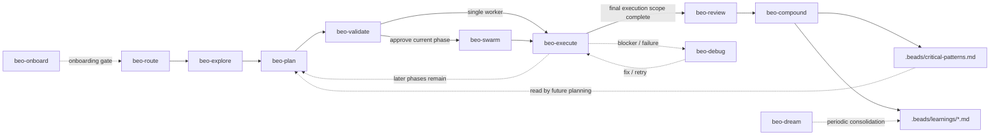

# beo

Twelve operational beo skills plus a shared reference corpus for structured, contract-driven feature development. Uses [`br`](https://github.com/Dicklesworthstone/beads_rust) (beads_rust) for issue tracking and [`bv`](https://github.com/Dicklesworthstone/beads_viewer) (Beads Viewer) for graph analytics. Pure Markdown skill definitions -- no application code.

---

## Pipeline



| Skill | Purpose |
| --- | --- |
| **beo-route** | Resolves canonical beo state and selects exactly one next target |
| **beo-explore** | Locks product requirements into `CONTEXT.md` before solution design |
| **beo-plan** | Converts locked context into current-phase technical design and executable beads |
| **beo-validate** | Gates current-phase execution readiness and selects `beo-execute` or `beo-swarm` |
| **beo-swarm** | Coordinates parallel workers for approved, independent beads |
| **beo-execute** | Implements and verifies exactly one approved bead |
| **beo-review** | Assesses completed current-phase work and issues `accept`, `fix`, or `reject` |
| **beo-compound** | Captures durable learnings from one accepted feature |

**Support skills** (invoked on demand): `beo-debug` (single-blocker diagnosis and minimal unblock), `beo-dream` (cross-feature learning consolidation), `beo-author` (skill-system authoring and pressure testing).

**Bootstrap**: `beo-onboard` -- readiness gate that verifies beo tooling and bootstrap state before any other skill proceeds.

**Shared reference**: `beo-reference` -- canonical shared protocol docs, CLI refs, status mapping, approval gates, and artifact rules.

---

## Prerequisites

| Tool | Required | Install |
| --- | --- | --- |
| [`br`](https://github.com/Dicklesworthstone/beads_rust) 0.1.28+ | Yes | `cargo install beads_rust` |
| [`bv`](https://github.com/Dicklesworthstone/beads_viewer) 0.15.2+ | Yes | See [bv docs](https://github.com/Dicklesworthstone/beads_viewer) |
| [`obsidian` CLI](https://github.com/Yakitrak/obsidian-cli) | No | Optional knowledge store mirror |
| [`qmd`](https://github.com/tobi/qmd) | No | Optional search enhancement |


The host environment needs shell execution, filesystem access, and skill/instruction loading. Subagent dispatch is recommended for planning and review. Swarming requires Agent Mail; without it, work falls back to sequential `beo-execute`.

---

## Installation

```bash
npx skills add https://github.com/minhtri2710/skills/tree/main/skills/beo
```

Verify: `br --version` (0.1.28+), `bv --version` (0.15.2+).

Or load skills manually by reading `skills/beo/route/SKILL.md` as the entry point.

---

## Editing Skills

- All `br`/`bv` commands must match CLI help output exactly
- Child beads use dotted IDs: `<parent-id>.<number>`
- Use `br label add/remove <ID> -l <label>` for label operations
- Always include `--no-daemon` on `br comments add`
- Artifact end markers use underscores: `---END_ARTIFACT---`
- Status mapping must match the shared reference documents

---

## License

[MIT with Commons Clause](LICENSE) -- Copyright (c) 2026 minhtri2710
