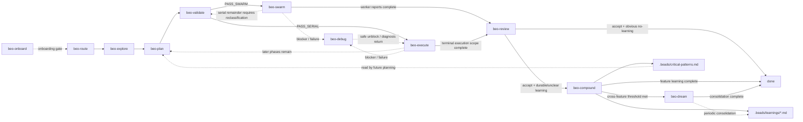

# beo

A skill repository for structured, contract-driven feature delivery with `br` (beads_rust) and `bv` (Beads Viewer). The repo contains 13 canonical beo skills, a shared reference corpus, onboarding scripts, and managed startup templates. It is primarily Markdown and support assets rather than product application code.

---

## Pipeline



| Category | Skill | Purpose |
| --- | --- | --- |
| Mainline | **beo-route** | Resolves canonical beo state and selects exactly one next target |
| Mainline | **beo-explore** | Locks product requirements into `CONTEXT.md` before solution design |
| Mainline | **beo-plan** | Converts locked context into current-phase technical design and executable beads |
| Mainline | **beo-validate** | Gates current-phase execution readiness and selects `beo-execute` or `beo-swarm` |
| Strategy | **beo-swarm** | Coordinates parallel workers for approved, independent beads |
| Mainline | **beo-execute** | Implements and verifies exactly one approved bead |
| Mainline | **beo-review** | Assesses completed current-phase work and issues `accept`, `fix`, or `reject` |
| Mainline | **beo-compound** | Captures durable learnings from one accepted feature |
| Bootstrap | **beo-onboard** | Verifies and minimally repairs beo tooling, bootstrap state, and managed startup readiness |
| Support | **beo-debug** | Diagnoses one non-obvious blocker and applies the smallest verified unblock |
| Support | **beo-dream** | Consolidates learnings across accepted features into corpus-level guidance |
| Meta | **beo-author** | Creates, revises, and pressure-tests beo skills and supporting references |
| Reference | **beo-reference** | Provides one targeted canonical reference document without doing operational work |

The minimal core runtime is `beo-route -> beo-explore -> beo-plan -> beo-validate -> beo-execute/beo-swarm -> beo-review -> done`.
Optional closure is `beo-review -> beo-compound -> beo-dream/done`.
`beo-swarm` is an execution strategy selected by validation, not a core delivery phase.
`review -> done` is the default accepted-work closure when `learning_disposition=no-learning` is obvious.

---

## Operator View

Use `skills/beo/reference/references/operator-card.md` as the first-pass operator view.
Its owner boundary matrix is the shortest reliable summary of:
- who decides what
- which surfaces each owner may write
- what each owner must not do

Canonical shared doctrine is split deliberately:
- owner selection, collision precedence, route suppression -> `skills/beo/route/SKILL.md`
- legal transitions -> `skills/beo/reference/references/pipeline.md`
- approval, grant/refresh/invalidation -> `skills/beo/reference/references/approval.md`
- state/handoff freshness and terminal done rule -> `skills/beo/reference/references/state.md`
- no-learning and consolidation thresholds -> `skills/beo/reference/references/learning.md`

## Repository Layout

```text
skills/beo/
  route/       state reconstruction and next-skill routing
  explore/     requirements locking
  plan/        current-phase technical planning and bead creation
  validate/    readiness gate and execution-mode selection
  swarm/       parallel worker orchestration
  execute/     single-bead delivery
  review/      post-execution verdicts
  compound/    single-feature learnings capture
  debug/       blocker diagnosis
  dream/       corpus maintenance
  author/      beo skill authoring
  onboard/     bootstrap and managed startup setup
  reference/   shared protocol and CLI corpus
```

Generated `*-workspace/` directories under `skills/beo/` are audit artifacts, not source.

---

## Prerequisites

| Tool | Required | Install |
| --- | --- | --- |
| [`br`](https://github.com/Dicklesworthstone/beads_rust) 0.1.28+ | Yes | `cargo install beads_rust` |
| [`bv`](https://github.com/Dicklesworthstone/beads_viewer) 0.15.2+ | Yes | See [bv docs](https://github.com/Dicklesworthstone/beads_viewer) |
| [`obsidian` CLI](https://github.com/Yakitrak/obsidian-cli) | No | Optional knowledge store mirror |
| [`qmd`](https://github.com/tobi/qmd) | No | Optional search enhancement |


The host environment needs shell execution, filesystem access, and skill/instruction loading. Delegation is optional and runtime-dependent: planning and review can run parallel isolated passes when the runtime supports worker spawning, but they must fall back to sequential passes when it does not. Swarming requires Agent Mail plus worker orchestration support; without both, work must return through `beo-validate` for serial reclassification rather than silently falling into `beo-execute`.

---

## Installation

```bash
npx skills add https://github.com/minhtri2710/skills/tree/main/skills/beo
```

Verify: `br --version` (0.1.28+), `bv --version` (0.15.2+).

Or load skills manually by reading `skills/beo/route/SKILL.md` as the entry point.

---

## Bootstrap and State

`beo-onboard` prepares the startup contract installed into `AGENTS.md` and the `.beads/` bootstrap state used by the rest of the workflow.

Managed bootstrap artifacts:

- `.beads/onboarding.json` -- onboarding completion state plus managed asset versions
- `.beads/beo_status.mjs` -- read-only scout command for recorded onboarding metadata, state, and optional handoff summary
- `.beads/STATE.json` -- canonical intra-session pipeline state
- `.beads/HANDOFF.json` -- optional cross-session resume checkpoint
- `.beads/critical-patterns.md` -- shared promoted guidance, initialized by onboarding when missing

Onboarding is treated as current only when the live `beo-onboard` check confirms all of the following:

- `.beads/onboarding.json` exists and reflects the current onboarder metadata
- `.beads/onboarding.json` reflects the current managed startup contract metadata
- the managed `AGENTS.md` block still matches the installed startup contract template

In practice this means `beo-route` should treat onboarding as a first-class gate owned by the live onboarder check, not by repo-local scout output or incidental metadata.

---

## Editing Skills

- All `br`/`bv` commands must match CLI help output exactly
- Child beads use dotted IDs: `<parent-id>.<number>`
- Use `br label add/remove <ID> -l <label>` for label operations
- Always include `--no-daemon` on `br comments add` and `br comments list`
- Artifact end markers use underscores: `---END_ARTIFACT---`
- Status mapping must match the shared reference documents

---

## License

[MIT with Commons Clause](LICENSE) -- Copyright (c) 2026 minhtri2710
