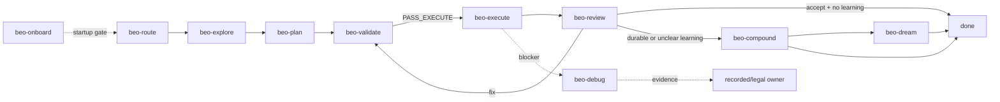

# beo

A skill repository for structured, contract-driven feature delivery with `br`
(beads_rust) and `bv` (Beads Viewer). The repo contains canonical beo skills,
shared references, onboarding scripts, and managed startup templates.

## Workflow



Core runtime:

`beo-route -> beo-explore -> beo-plan -> beo-validate -> beo-execute -> beo-review -> done`

Optional closure:

`beo-review -> beo-compound -> beo-dream/done`

## 30-second model

- `beo-route` selects one owner only when owner state is missing, stale, contradictory, or colliding.
- `beo-validate` is the only owner that emits `PASS_EXECUTE`.
- `beo-execute` only mutates the selected approved execution set.
- `beo-review` is the only terminal verdict owner.
- Cards are display-only unless emitted by the owning skill.

Go mode only reduces unnecessary operator prompts. It does not bypass owner selection, approval, readiness, execution scope, review, or learning gates. Canonical behavior is in
`skills/beo/reference/references/go-mode.md`.

## Skill map

| Category | Skill | Purpose |
| --- | --- | --- |
| Runtime | `beo-route` | Select exactly one current owner when state is missing, stale, contradictory, or colliding |
| Runtime | `beo-explore` | Lock requirements into `CONTEXT.md` |
| Runtime | `beo-plan` | Convert locked requirements into `PLAN.md` and executable beads |
| Runtime | `beo-validate` | Verify readiness and select one execution set |
| Runtime | `beo-execute` | Deliver the approved execution set inside scope |
| Runtime | `beo-review` | Emit one terminal verdict for completed work |
| Closure | `beo-compound` | Record one accepted feature learning outcome |
| Closure | `beo-dream` | Consolidate repeated accepted-feature learnings |
| Support | `beo-debug` | Prove one blocker root cause and return evidence |
| Bootstrap | `beo-onboard` | Verify and repair managed startup surfaces |
| Meta | `beo-author` | Author, simplify, dedupe, and manually review beo contracts |
| Reference | `beo-reference` | Return targeted canonical references without operational work |

## Operator entry points

- First-pass view: `skills/beo/reference/references/operator-card.md`
- Legal transitions: `skills/beo/reference/references/pipeline.md`
- Approval: `skills/beo/reference/references/approval.md`
- State and handoff: `skills/beo/reference/references/state.md`
- Artifacts and schemas: `skills/beo/reference/references/artifacts.md`
- Learning thresholds: `skills/beo/reference/references/learning.md`
- Exact command forms: `skills/beo/reference/references/cli.md`
- Doctrine ownership: `skills/beo/reference/references/doctrine-map.md`

## Repository layout

```text
skills/beo/
  route/       owner selection and state reconstruction
  explore/     requirements locking
  plan/        current-phase planning and bead graph creation
  validate/    readiness gate and execution-set selection
  execute/     approved execution-set delivery
  review/      terminal review verdicts
  compound/    single-feature learning capture
  dream/       cross-feature learning consolidation
  debug/       blocker diagnosis
  onboard/     bootstrap and managed startup setup
  author/      skill authoring and doctrine cleanup
  reference/   shared canonical references
```

Generated `*-workspace/` directories under `skills/beo/` are audit artifacts, not
source.

## Prerequisites

| Tool | Required | Purpose |
| --- | --- | --- |
| `br` 0.1.28+ | Yes | bead graph inspection and updates |
| `bv` 0.15.2+ | Yes | Beads Viewer inspection |
| `node` | Yes for onboarding | run managed onboarding script |

## Optional integrations

| Tool | Purpose |
| --- | --- |
| `obsidian` CLI | optional external knowledge-store integration |
| `qmd` | optional external knowledge-store search |

## Installation

```bash
npx skills add https://github.com/minhtri2710/skills/tree/main/skills/beo
```

Verify the core CLIs with `br --version` and `bv --version`.

## Bootstrap overview

`beo-onboard` installs and verifies the managed startup block in `AGENTS.md` and
the `.beads/` startup orientation surfaces. For exact startup behavior, read
`AGENTS.md` and `skills/beo/onboard/`.

## Editing skills

Skill authoring rules are canonical in:
- `skills/beo/author/SKILL.md`
- `skills/beo/reference/references/authoring.md`
- `skills/beo/reference/references/doctrine-map.md`

README is an overview only. It does not approve execution, select owners,
validate readiness, define state semantics, or replace canonical references.

## License

[MIT with Commons Clause](LICENSE) -- Copyright (c) 2026 minhtri2710
