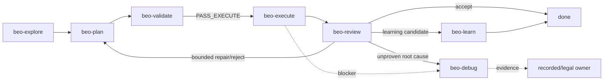

# beo-skills

Canonical BEO skills and references for contract-driven feature delivery.



Core delivery: `beo-explore -> beo-plan -> beo-validate -> beo-execute -> beo-review -> done` for accepted work.

Identity repair: `beo-route` only for true owner identity defects when current artifacts cannot identify a legal owner.

Review exits: accept to `done`, learning candidates to `beo-learn`, unproven root causes to `beo-debug`, and bounded repair/reject verdicts to `beo-plan`.

Optional closure: `beo-learn -> beo-author` only on explicit request with selected evidence.

## 30-second model

- Owner `SKILL.md` must be loaded before owner-owned mutation.
- `beo-validate` alone grants `PASS_EXECUTE`.
- `beo-execute` alone mutates product files.
- `beo-review` alone emits terminal verdicts.
- Generated/advisory surfaces never create authority.

## Operator entry points

- Runtime playbook: `beo-reference -> references/runtime-playbook.md`
- Legal transitions: `beo-reference -> registry/pipeline.json`
- Artifact model: `beo-reference -> references/artifacts.md`
- Approval: `beo-reference -> references/approval.md`
- State and handoff: `beo-reference -> references/state.md`
- Command contracts: `beo-reference -> registry/command-contracts.json`
- Doctrine ownership: `beo-reference -> references/doctrine-map.md`

## Repository layout

```text
skills/beo/
  explore/    requirements lock
  plan/       executable scope
  validate/   readiness and approval
  execute/    approved execution-set delivery
  review/     terminal review verdicts
  debug/      blocker diagnosis
  route/      owner identity repair
  setup/      setup/check/usage
  learn/      optional learning extension
  author/     explicit doctrine authoring extension
  reference/  shared references, registries, scripts, templates
```

README is overview only. It does not approve execution, select owners, validate readiness, define state semantics, or replace canonical references.
