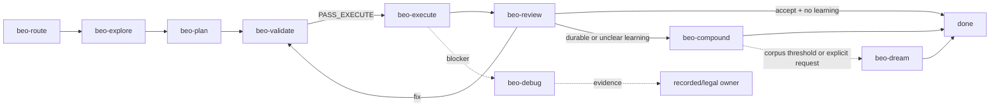

# beo

A skill repository for structured, contract-driven feature delivery with `br` (beads_rust) and `bv` (Beads Viewer). The repo contains canonical beo skills, shared references, and a setup-only `AGENTS.md` template.

## Workflow



Core runtime:

`beo-route -> beo-explore -> beo-plan -> beo-validate -> beo-execute -> beo-review -> done`

Optional closure:

`beo-review -> beo-compound -> beo-dream/done`

## 30-second model

- `beo-route` selects one owner only when owner state is missing, stale, contradictory, or colliding.
- `beo-validate` is the only owner that emits `PASS_EXECUTE`.
- `beo-execute` only mutates the selected approved execution set.
- `beo-review` is the only terminal verdict owner.
- Startup is advisory and does not grant readiness, approval, execution-set selection, review verdicts, or learning promotion.
- Cards are display-only unless emitted by the owning skill.

Go mode changes assumption posture only. It does not bypass owner selection, Human approval gates, UAT gates, validation, approval freshness, `PASS_EXECUTE`, execution scope, review, or learning thresholds. Canonical behavior is in `beo-reference -> references/go-mode.md`.

## Skill map

| Category | Skill | Purpose |
| --- | --- | --- |
| Runtime | `beo-route` | Select exactly one current owner when state is missing, stale, contradictory, or colliding |
| Runtime | `beo-explore` | Lock requirements into `CONTEXT.md` |
| Runtime | `beo-plan` | Convert locked requirements into `PLAN.md` and executable beads |
| Runtime | `beo-validate` | Verify readiness and select one execution set |
| Runtime | `beo-execute` | Deliver the approved execution set inside scope |
| Runtime | `beo-review` | Emit one terminal verdict for completed work |
| Closure | `beo-compound` | Record one accepted feature learning outcome |
| Closure | `beo-dream` | Consolidate repeated accepted-feature learnings or explicit corpus requests |
| Support | `beo-debug` | Prove one blocker root cause and return evidence |
| Meta | `beo-author` | Author, simplify, dedupe, and manually review beo contracts |
| Reference | `beo-reference` | Return targeted canonical references without operational work |

## Operator entry points

- First-pass view: `beo-reference -> references/operator-card.md`
- Legal transitions: `beo-reference -> references/pipeline.md`
- Approval: `beo-reference -> references/approval.md`
- State and handoff: `beo-reference -> references/state.md`
- Artifacts and schemas: `beo-reference -> references/artifacts.md`
- Learning thresholds: `beo-reference -> references/learning.md`
- Exact command forms: `beo-reference -> references/cli.md`
- Doctrine ownership: `beo-reference -> references/doctrine-map.md`

## Repository layout

```text
skills/beo/
  route/       exceptional owner-state repair
  explore/     requirements locking
  plan/        current executable planning and bead graph creation
  validate/    readiness gate and execution-set selection
  execute/     approved execution-set delivery
  review/      terminal review verdicts
  compound/    single-feature learning capture
  dream/       cross-feature learning consolidation
  debug/       blocker diagnosis
  author/      skill authoring and doctrine cleanup
  reference/   shared canonical references and setup assets
```

Generated `*-workspace/` directories under `skills/beo/` are audit artifacts, not source.

## Prerequisites

| Tool | Required | Purpose |
| --- | --- | --- |
| `br` 0.1.28+ | Yes | bead graph inspection and updates |
| `bv` 0.15.2+ | Yes | Beads Viewer inspection |

## Optional integrations

| Tool | Purpose |
| --- | --- |
| `obsidian` CLI | optional external knowledge-store integration |
| `qmd` | optional external knowledge-store search |

## Installation

```bash
npx skills add https://github.com/minhtri2710/skills/tree/main/skills/beo
```

Verify the core CLIs with `br --version` and `bv --version`.

## AGENTS.md setup

For a new BEO project, ensure `AGENTS.md` exists.

- If `AGENTS.md` is missing, create it from `beo-reference -> assets/AGENTS.template.md`.
- If `AGENTS.md` exists but lacks the BEO managed block, append the managed block from `beo-reference -> assets/AGENTS.template.md`.
- If `AGENTS.md` already contains the managed block, do not change it unless the user explicitly requests a refresh.
- If the managed block markers are duplicated or malformed, ask the user before editing.

This is setup-only. It is not a runtime owner.

## Editing skills

Skill authoring rules are canonical in:

- `skills/beo/author/SKILL.md`
- `beo-reference -> references/authoring.md`
- `beo-reference -> references/doctrine-map.md`

README is an overview only. It does not approve execution, select owners, validate readiness, define state semantics, or replace canonical references.

## License

[MIT with Commons Clause](LICENSE) -- Copyright (c) 2026 minhtri2710
