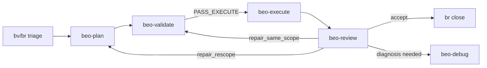

# beo-skills

Canonical BEO skills and references for Beads-anchored, contract-driven feature delivery.

Core delivery: `bv/br triage -> beo-plan -> beo-validate -> beo-execute -> beo-review -> br close` for accepted atomic beads.

## 30-second model

- `br` owns issue identity, lifecycle, dependencies, claims, comments, ready queue, and closure.
- `bv` provides graph-aware triage and orientation only.
- BEO owns Human Gates, atomic scope, `PASS_EXECUTE`, mutation boundary, execution evidence, and review verdict.
- Only atomic beads are approved or executed.
- Only `beo-validate` grants `PASS_EXECUTE`.
- Only `beo-execute` mutates approved product paths.
- Only `beo-review` emits terminal verdicts.

## Operator entry points

- Kernel: `beo-reference -> references/kernel.md`
- Beads authority: `beo-reference -> references/beads-authority.md`
- BV triage: `beo-reference -> references/triage.md`
- Ticket contract: `beo-reference -> references/ticket.md`
- Approval: `beo-reference -> references/approval.md`
- Mutation safety: `beo-reference -> references/mutation-safety.md`
- Runtime events: `beo-reference -> references/events.md`
- Legal transitions: `beo-reference -> registry/pipeline.json`
- Command contracts: `beo-reference -> registry/command-contracts.json`

README is overview only. It does not approve execution, select owners, validate readiness, define lifecycle authority, or replace canonical references.
