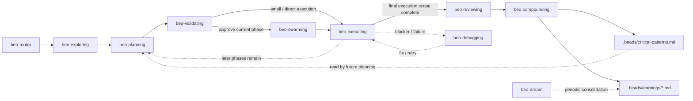

# beo

Twelve AI agent skills for structured, plan-first feature development. Uses [`br`](https://github.com/Dicklesworthstone/beads_rust) (beads_rust) for issue tracking and [`bv`](https://github.com/Dicklesworthstone/beads_viewer) (Beads Viewer) for graph analytics to enforce a disciplined pipeline from requirements gathering through code review, with optional knowledge store integration via Obsidian CLI and QMD.

This is a pure content repository -- no application code, no build system, only Markdown skill definitions and YAML metadata. The skills are designed to be loaded by AI coding agents (Claude Code, OpenCode, Codex, etc.) that support skill/instruction loading.

> [MIT with Commons Clause](LICENSE) -- Copyright (c) 2026 minhtri2710

---

## Table of Contents

- [Why beo?](#why-beo)
- [Skills Overview](#skills-overview)
  - [Core Pipeline](#core-pipeline)
  - [Support and Meta Skills](#support-and-meta-skills)
  - [Shared Reference Hub](#shared-reference-hub)
- [How It Works](#how-it-works)
  - [Pipeline Flow](#pipeline-flow)
  - [Planning Modes](#planning-modes)
  - [What Each Skill Does](#what-each-skill-does)
  - [Key Artifacts Produced](#key-artifacts-produced)
- [Prerequisites](#prerequisites)
- [Installation](#installation)
  - [Claude Code](#claude-code)
  - [OpenCode](#opencode)
  - [OpenAI Codex](#openai-codex)
  - [Manual Loading](#manual-loading)
- [Usage](#usage)
  - [Starting a New Feature](#starting-a-new-feature)
  - [Resuming Work](#resuming-work)
  - [Standalone Debugging](#standalone-debugging)
  - [Capturing Learnings](#capturing-learnings)
- [Project Structure](#project-structure)
  - [Repository Layout](#repository-layout)
  - [Skill Directory Structure](#skill-directory-structure)
  - [Reference Documents](#reference-documents)
- [Architecture](#architecture)
  - [Pipeline State Machine](#pipeline-state-machine)
  - [Bead Lifecycle](#bead-lifecycle)
  - [Agent Coordination](#agent-coordination)
  - [Knowledge Flywheel](#knowledge-flywheel)
- [Skill Reference](#skill-reference)
  - [beo-router](#beo-router)
  - [beo-exploring](#beo-exploring)
  - [beo-planning](#beo-planning)
  - [beo-validating](#beo-validating)
  - [beo-swarming](#beo-swarming)
  - [beo-executing](#beo-executing)
  - [beo-reviewing](#beo-reviewing)
  - [beo-compounding](#beo-compounding)
  - [beo-debugging](#beo-debugging)
  - [beo-dream](#beo-dream)
  - [beo-writing-skills](#beo-writing-skills)
  - [beo-reference](#beo-reference)
- [Editing Skills](#editing-skills)
- [FAQ](#faq)
- [License](#license)

---

## Why beo?

AI coding agents are powerful but undisciplined. Without structure, they jump straight to code, skip requirements, produce plans nobody verified, and forget what they learned last time. beo solves this by encoding a proven development workflow as agent skills:

- **No code without a verified plan.** The validating gate enforces 8-dimension verification before any implementation begins.
- **Requirements are locked first.** Exploring uses Socratic dialogue to surface and freeze decisions into `CONTEXT.md` before planning starts.
- **Planning distinguishes feature strategy from current-phase execution.** Planning writes research and strategy artifacts first, then prepares only the current phase for validation and implementation.
- **Parallel execution with coordination.** Swarming orchestrates multiple worker agents via Agent Mail, with file reservations and blocker handling.
- **Institutional memory.** Compounding captures learnings after every feature. Dream consolidates them periodically. Critical patterns are read by every future planning phase -- the system gets smarter over time.
- **Debuggable.** When a worker gets stuck, the debugging skill provides systematic root-cause analysis instead of guessing.

---

## Skills Overview

### Core Pipeline

The 8 core skills execute in sequence. Each skill has a clear entry condition, produces specific artifacts, and hands off to the next. See [Skill Reference](#skill-reference) for complete details.

```
beo-router --> beo-exploring --> beo-planning --> beo-validating --> beo-swarming --> beo-executing --> beo-reviewing --> beo-compounding
```

| Skill               | Purpose |
| ------------------- | ------- |
| **beo-router**      | Detects project state via `br`/`bv` CLI and routes to the correct phase skill |
| **beo-exploring**   | Socratic dialogue to lock requirements and decisions into `CONTEXT.md` |
| **beo-planning**    | Research + synthesis → `discovery.md`, `approach.md`, optional `phase-plan.md`, then current-phase `phase-contract.md`, `story-map.md`, and beads |
| **beo-validating**  | 8-dimension verification gate -- current phase must pass before any code is written |
| **beo-swarming**    | Orchestrates parallel worker agents for feature execution via Agent Mail |
| **beo-executing**   | Per-worker implementation loop -- claim, build prompt, dispatch, verify, report |
| **beo-reviewing**   | 5 specialist review agents with P1/P2/P3 severity; hands off to compounding |
| **beo-compounding** | Captures learnings from completed features, promotes critical patterns |

### Support and Meta Skills

These are invoked on demand at any pipeline stage.

| Skill                  | Purpose |
| ---------------------- | ------------------------------------------------------------------------------------------------ |
| **beo-debugging**      | Systematic root-cause analysis for blocked workers, test failures, build errors, runtime crashes |
| **beo-dream**          | Periodic consolidation of learnings across features into refined knowledge |
| **beo-writing-skills** | TDD-for-skills methodology: create, pressure-test, and iterate on new beo skill definitions |

### Shared Reference Hub

| Skill             | Purpose |
| ----------------- | --------------------------------------------------------------------------------------------------- |
| **beo-reference** | Navigation hub for shared reference documents (CLI refs, status mapping, artifact protocol, handoff shape, approval gates, artifact semantics, and other canonical workflow rules) |

---

## How It Works

### Pipeline Flow



The key planning rule is that `beo-planning`, `beo-validating`, `beo-executing`, and `beo-reviewing` all operate on the **current phase**. In multi-phase work, current-phase completion routes back to planning until the final execution scope is complete.

### Planning Modes

beo planning supports two shapes of work:

#### Single-phase planning
Use this when one believable closed loop is enough.

Typical artifact set:
- `CONTEXT.md`
- `discovery.md`
- `approach.md`
- `plan.md`
- `phase-contract.md`
- `story-map.md`

#### Multi-phase planning
Use this when the feature should unfold across multiple capability slices.

Typical artifact set:
- `CONTEXT.md`
- `discovery.md`
- `approach.md`
- `plan.md`
- `phase-plan.md`
- `phase-contract.md` *(current phase only)*
- `story-map.md` *(current phase only)*

In multi-phase work, `phase-plan.md` explains the whole feature sequence, while `phase-contract.md` and `story-map.md` describe only the current phase being validated and executed now.

### Key Artifacts Produced

| Artifact | Producer | Consumer | Purpose |
| ----------------------------- | ----------- | ------------------------------- | ------------------------------------ |
| `CONTEXT.md` | exploring | planning, all downstream | Frozen requirements and decisions |
| `discovery.md` | planning | validating, compounding | Research findings and implementation landscape |
| `approach.md` | planning | validating, executing, reviewing, future planning cycles | Chosen strategy, alternatives, risks |
| `plan.md` | planning | validating, executing, compounding | Human-readable plan narrative |
| `phase-plan.md` | planning | router, validating, future planning cycles | Optional whole-feature sequencing for multi-phase work |
| `phase-contract.md` | planning | validating, swarming | Current-phase scope, success criteria, constraints |
| `story-map.md` | planning | validating | Current-phase story order and task mapping |
| `.beads/` directory | `br` CLI | all skills | Bead database, JSONL export, config |
| `.beads/critical-patterns.md` | compounding | planning, validating, debugging | Institutional memory |
| `.beads/learnings/*.md` | compounding | dream | Per-feature learnings |

---

## Prerequisites

| Tool | Version | Required | Install | Purpose |
| --------------------------------------------------------- | ------- | -------- | ---------------------------------------------------------------- | --------------------------------------- |
| [`br`](https://github.com/Dicklesworthstone/beads_rust) | 0.1.28+ | Yes | `cargo install beads_rust` | Local-first issue tracker for AI agents |
| [`bv`](https://github.com/Dicklesworthstone/beads_viewer) | 0.15.2+ | Yes | See [bv docs](https://github.com/Dicklesworthstone/beads_viewer) | Graph analytics, triage, scheduling |
| `obsidian` CLI | any | No | [Obsidian CLI](https://github.com/Yakitrak/obsidian-cli) | Knowledge store write operations |
| [`qmd`](https://github.com/tobi/qmd) | any | No | See [qmd docs](https://github.com/tobi/qmd) | Knowledge store search/query |

You also need an AI coding agent that supports skill/instruction loading:

- [Claude Code](https://docs.anthropic.com/en/docs/claude-code) (loads from `~/.agents/skills/`)
- [OpenCode](https://opencode.ai) (loads from `~/.agents/skills/`)
- [OpenAI Codex](https://openai.com/index/codex/) (uses `agents/openai.yaml` manifests)

---

## Installation

Recommended install for skill-aware agents:

```bash
npx skills add https://github.com/minhtri2710/skills
```

This installs the skill pack from the repository so skills become available as `beo-router`, `beo-exploring`, and the rest of the beo suite.

### Claude Code

Use the recommended install command above.

### OpenCode

Use the same install command above.

### OpenAI Codex

Use the same install command if your Codex environment supports `skills`. Otherwise, each skill includes an `agents/openai.yaml` manifest for Codex platform discovery, so you can point Codex at the repository or copy the skill directories into your Codex agent configuration.

### Manual Loading

If your agent doesn't support automatic skill discovery, you can load any skill by reading its `SKILL.md` file directly. The router skill is the recommended entry point:

```bash
# Read the router skill
cat skills/beo/router/SKILL.md
```

---

## Editing Skills

When editing any `SKILL.md` file:

- All `br` and `bv` commands must match the CLI help output exactly
- Child beads use dotted IDs: `<parent-id>.<number>`
- Use `br label add/remove <ID> -l <label>` for label operations
- Always include `--no-daemon` on `br comments add` commands
- Artifact end markers use underscores: `---END_ARTIFACT---`
- Status mapping must match the shared reference documents

## License

MIT with Commons Clause
