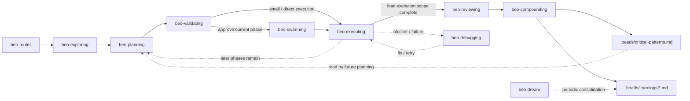

# beo

Twelve AI agent skills for structured, plan-first feature development. Uses [`br`](https://github.com/Dicklesworthstone/beads_rust) (beads_rust) for issue tracking and [`bv`](https://github.com/Dicklesworthstone/beads_viewer) (Beads Viewer) for graph analytics. Pure Markdown skill definitions -- no application code.

---

## Pipeline



| Skill | Purpose |
| --- | --- |
| **beo-router** | Detects project state via `br`/`bv` and routes to the correct phase |
| **beo-exploring** | Socratic dialogue to lock requirements into `CONTEXT.md` |
| **beo-planning** | Research + synthesis into discovery, approach, plan, and current-phase artifacts |
| **beo-validating** | 8-dimension verification gate before any code is written |
| **beo-swarming** | Parallel worker orchestration via Agent Mail |
| **beo-executing** | Per-worker implementation loop: claim, build, verify, report |
| **beo-reviewing** | 5 specialist review agents with P1/P2/P3 severity |
| **beo-compounding** | Captures learnings, promotes critical patterns |

**Support skills** (invoked on demand): `beo-debugging` (root-cause analysis), `beo-dream` (periodic learnings consolidation), `beo-writing-skills` (TDD for new skills).

**Shared reference**: `beo-reference` -- canonical CLI refs, status mapping, approval gates, artifact protocol.

---

## Prerequisites

| Tool | Required | Install |
| --- | --- | --- |
| [`br`](https://github.com/Dicklesworthstone/beads_rust) 0.1.28+ | Yes | `cargo install beads_rust` |
| [`bv`](https://github.com/Dicklesworthstone/beads_viewer) 0.15.2+ | Yes | See [bv docs](https://github.com/Dicklesworthstone/beads_viewer) |
| [`obsidian` CLI](https://github.com/Yakitrak/obsidian-cli) | No | Optional knowledge store mirror |
| [`qmd`](https://github.com/tobi/qmd) | No | Optional search enhancement |
| [`cass`](https://github.com/Dicklesworthstone/cass) | No | Session/learnings indexing |
| [`cm`](https://github.com/Dicklesworthstone/cm) | No | Cognitive-memory storage |

The host environment needs shell execution, filesystem access, and skill/instruction loading. Subagent dispatch is recommended for planning and reviewing. Swarming requires Agent Mail; without it, falls back to sequential `beo-executing`.

---

## Installation

```bash
npx skills add https://github.com/minhtri2710/skills
```

Verify: `br --version` (0.1.28+), `bv --version` (0.15.2+).

Or load skills manually by reading `skills/beo/router/SKILL.md` as the entry point.

---

## Editing Skills

- All `br`/`bv` commands must match CLI help output exactly
- Child beads use dotted IDs: `<parent-id>.<number>`
- Use `br label add/remove <ID> -l <label>` for label operations
- Always include `--no-daemon` on `br comments add`
- Artifact end markers use underscores: `---END_ARTIFACT---`
- Status mapping must match the shared reference documents

---

## License

[MIT with Commons Clause](LICENSE) -- Copyright (c) 2026 minhtri2710
