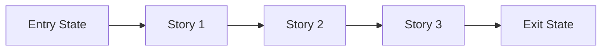

# Phase Contract: <Phase Name>

````markdown
# Phase Contract: <Phase Name>

**Date**: <YYYY-MM-DD>
**Phase Slug**: <phase-slug>
**Whole Plan Reference**: <optional path or summary>
**Based on**:
- `.beads/artifacts/<feature_slug>/CONTEXT.md`
- `.beads/artifacts/<feature_slug>/discovery.md`
- `.beads/artifacts/<feature_slug>/plan.md`

## Why This Phase Exists
<2-4 sentences on why this phase matters now, not later>

## Whole Plan Fit
### What Comes Before
- <prior capability or assumption already in place>

### What This Phase Adds
- <specific capability this phase contributes>

### What It Unlocks Next
- <next phase or capability this makes possible>

## Entry State
- <observable truth>
- <observable truth>
- <already-satisfied dependency or constraint>

## Exit State
- <observable truth>
- <observable truth>
- <integration or system-level truth>

Every exit-state line must be testable or demonstrable. Prefer invariants over hardcoded counts.

## Demo Story
<one short paragraph: "A user can now..." or "The system can now...">

### Demo Checklist
- [ ] <step 1>
- [ ] <step 2>
- [ ] <step 3>

## Story Outline
| Story | Purpose | Why Now | Unlocks | Done Looks Like |
| --- | --- | --- | --- | --- |
| Story 1: <name> | <purpose> | <why first> | <what it unlocks> | <observable proof> |
| Story 2: <name> | <purpose> | <why next> | <what it unlocks> | <observable proof> |
| Story 3: <name> | <purpose> | <why last> | <what it unlocks> | <observable proof> |

## Phase Diagram


Remove unused nodes and keep the diagram aligned to the real sequence.

## Out Of Scope
- <thing intentionally not solved here>
- <adjacent idea deferred>

## Success Signals
- <how reviewers or UAT know this phase genuinely worked>
- <what should be explicitly confirmed>

## Failure / Pivot Signals
- <signal that the phase design is wrong>
- <signal that the current approach should pivot>
- <signal that the next phase should be reconsidered>
````
