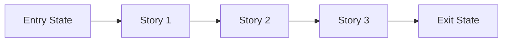

# Phase Contract: <Phase Name>

**Date**: <YYYY-MM-DD>
**Phase Slug**: <phase-slug>
**Whole Plan Reference**: `<optional path or summary>`
**Based on**:
- `.beads/artifacts/<feature_slug>/CONTEXT.md`
- `.beads/artifacts/<feature_slug>/discovery.md`
- `.beads/artifacts/<feature_slug>/plan.md`

## Table of Contents

- [1. Why This Phase Exists](#1-why-this-phase-exists)
- [2. Whole Plan Fit](#2-whole-plan-fit)
- [3. Entry State](#3-entry-state)
- [4. Exit State](#4-exit-state)
- [5. Demo Story](#5-demo-story)
- [6. Story Outline](#6-story-outline)
- [7. Phase Diagram](#7-phase-diagram)
- [8. Out Of Scope](#8-out-of-scope)
- [9. Success Signals](#9-success-signals)
- [10. Failure / Pivot Signals](#10-failure--pivot-signals)

---

## 1. Why This Phase Exists

`<2-4 sentences on why this phase matters now, not later.>`

---

## 2. Whole Plan Fit

### What Comes Before

- `<prior capability or assumption already in place>`

### What This Phase Contributes

- `<specific capability this phase adds to the larger plan>`

### What It Unlocks Next

- `<next phase or capability that becomes possible>`

---

## 3. Entry State

- `<observable truth 1>`
- `<observable truth 2>`
- `<constraint or dependency already satisfied>`

---

## 4. Exit State

- `<observable truth 1>`
- `<observable truth 2>`
- `<integration or system-level truth>`

**Rule:** Every exit-state line must be testable or demonstrable.

**Rule:** Use invariant-based criteria, not hardcoded counts. For refactoring, prefer "all tests pass" over "all N tests pass" — moving code legitimately changes counts.

---

## 5. Demo Story

`<In one short paragraph: "A user can now..." or "The system can now...">`

### Demo Checklist

- [ ] `<step 1>`
- [ ] `<step 2>`
- [ ] `<step 3>`

---

## 6. Story Outline

| Story | Purpose | Why Now | Unlocks | Done Looks Like |
|-------|---------|---------|---------|-----------------|
| Story 1: `<name>` | `<purpose>` | `<why first>` | `<what it unlocks>` | `<observable done>` |
| Story 2: `<name>` | `<purpose>` | `<why next>` | `<what it unlocks>` | `<observable done>` |
| Story 3: `<name>` | `<purpose>` | `<why last>` | `<what it unlocks>` | `<observable done>` |

---

## 7. Phase Diagram

Remove unused nodes and keep the diagram aligned to the actual sequence.

---

## 8. Out Of Scope

- `<thing intentionally not solved here>`
- `<adjacent idea deferred to later>`

---

## 9. Success Signals

- `<how we know this phase genuinely worked>`
- `<what reviewers/UAT should specifically confirm>`

---

## 10. Failure / Pivot Signals

If any of these happen, do not blindly continue the whole plan.

- `<signal that means the phase design is wrong>`
- `<signal that means the current approach should pivot>`
- `<signal that means the next phase should be reconsidered>`
