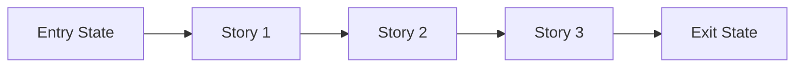

# Story Map: <Phase Name>

````markdown
# Story Map: <Phase Name>

**Date**: <YYYY-MM-DD>
**Phase Contract**: `.beads/artifacts/<feature_slug>/phase-contract.md`
**Plan Reference**: `.beads/artifacts/<feature_slug>/plan.md`

## Story Dependency Diagram


Replace placeholders with real story names. Show parallel branches explicitly when they exist.

## Story Table
| Story | Purpose | Why Now | Contributes To | Creates | Unlocks | Done Looks Like |
| --- | --- | --- | --- | --- | --- | --- |
| Story 1: <name> | <purpose> | <why first> | <exit-state item> | <artifact or capability> | <next story> | <observable proof> |
| Story 2: <name> | <purpose> | <why next> | <exit-state item> | <artifact or capability> | <next story> | <observable proof> |
| Story 3: <name> | <purpose> | <why last> | <exit-state item> | <artifact or capability> | <next phase or outcome> | <observable proof> |

## Story Details
### Story 1: <name>
- **Purpose**: <what this story makes true>
- **Why Now**: <why it belongs before later stories>
- **Contributes To**: <exit-state line it advances>
- **Creates**: <code, contract, data, or capability>
- **Unlocks**: <what later stories can now do>
- **Done Looks Like**: <observable finish line>
- **Candidate Bead Themes**:
  - <theme 1>
  - <theme 2>

### Story 2: <name>
- **Purpose**: <what this story makes true>
- **Why Now**: <why it belongs here>
- **Contributes To**: <exit-state line it advances>
- **Creates**: <code, contract, data, or capability>
- **Unlocks**: <what later stories can now do>
- **Done Looks Like**: <observable finish line>
- **Candidate Bead Themes**:
  - <theme 1>
  - <theme 2>

### Story 3: <name>
- **Purpose**: <what this story makes true>
- **Why Now**: <why it closes the phase>
- **Contributes To**: <exit-state line it advances>
- **Creates**: <code, contract, data, or capability>
- **Unlocks**: <next phase or larger outcome>
- **Done Looks Like**: <observable finish line>
- **Candidate Bead Themes**:
  - <theme 1>
  - <theme 2>

Remove unused story sections.

## Closure Check
- [ ] If every story reaches its done line, the phase exit state becomes true

If not, revise the map before creating beads.

## Story-To-Bead Mapping
Fill after bead creation.

| Story | Beads | Notes |
| --- | --- | --- |
| Story 1: <name> | <br-id>, <br-id> | <shared context or dependency note> |
| Story 2: <name> | <br-id>, <br-id> | <shared context or dependency note> |
| Story 3: <name> | <br-id>, <br-id> | <shared context or dependency note> |
````
