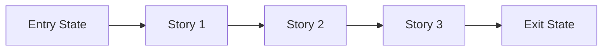
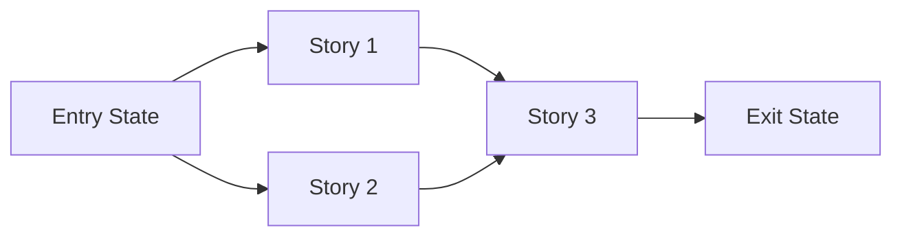

# Story Map: <Phase Name>

**Date**: <YYYY-MM-DD>
**Phase Contract**: `.beads/artifacts/<feature-name>/phase-contract.md`
**Approach Reference**: `.beads/artifacts/<feature-name>/plan.md`

## Table of Contents

- [1. Story Dependency Diagram](#1-story-dependency-diagram)
- [2. Story Table](#2-story-table)
- [3. Story Details](#3-story-details)
- [4. Closure Check](#4-closure-check)
- [5. Story-To-Bead Mapping](#5-story-to-bead-mapping)

---

## 1. Story Dependency Diagram

Replace the placeholder story nodes with the actual story names. If multiple
stories can run in parallel, show that explicitly:

---

## 2. Story Table

| Story | Purpose | Why Now | Contributes To | Creates | Unlocks | Done Looks Like |
|-------|---------|---------|----------------|---------|---------|-----------------|
| Story 1: `<name>` | `<purpose>` | `<why first>` | `<phase exit-state item>` | `<artifacts/capability>` | `<next story>` | `<observable proof>` |
| Story 2: `<name>` | `<purpose>` | `<why next>` | `<phase exit-state item>` | `<artifacts/capability>` | `<next story>` | `<observable proof>` |
| Story 3: `<name>` | `<purpose>` | `<why last>` | `<phase exit-state item>` | `<artifacts/capability>` | `<what comes after phase>` | `<observable proof>` |

---

## 3. Story Details

### Story 1: <Name>

- **Purpose**: `<what this story makes true>`
- **Why Now**: `<why it belongs before the next story>`
- **Contributes To**: `<which exit-state statement this story advances>`
- **Creates**: `<code, contract, data, capability>`
- **Unlocks**: `<what later stories can now do>`
- **Done Looks Like**: `<observable finish line>`
- **Candidate Bead Themes**:
  - `<bead theme 1>`
  - `<bead theme 2>`

### Story 2: <Name>

- **Purpose**: `<what this story makes true>`
- **Why Now**: `<why it belongs here>`
- **Contributes To**: `<which exit-state statement this story advances>`
- **Creates**: `<code, contract, data, capability>`
- **Unlocks**: `<what later stories can now do>`
- **Done Looks Like**: `<observable finish line>`
- **Candidate Bead Themes**:
  - `<bead theme 1>`
  - `<bead theme 2>`

### Story 3: <Name>

- **Purpose**: `<what this story makes true>`
- **Why Now**: `<why it closes the phase>`
- **Contributes To**: `<which exit-state statement this story advances>`
- **Creates**: `<code, contract, data, capability>`
- **Unlocks**: `<next phase or larger plan>`
- **Done Looks Like**: `<observable finish line>`
- **Candidate Bead Themes**:
  - `<bead theme 1>`
  - `<bead theme 2>`

Remove any unused story sections and keep only the stories the phase actually
needs.

---

## 4. Closure Check

> If every story reaches its "Done Looks Like" line, should the phase exit state
> be true?

- [ ] Yes: the story set fully closes the phase loop
- [ ] No: missing story or exit-state coverage remains

If "No", revise the map before creating beads.

---

## 5. Story-To-Bead Mapping

> Fill this in after bead creation so downstream validation and swarming can see
> how the narrative maps to executable work.

| Story | Beads | Notes |
|-------|-------|-------|
| Story 1: `<name>` | `<br-id>, <br-id>` | `<shared context or dependency note>` |
| Story 2: `<name>` | `<br-id>, <br-id>` | `<shared context or dependency note>` |
| Story 3: `<name>` | `<br-id>, <br-id>` | `<shared context or dependency note>` |
